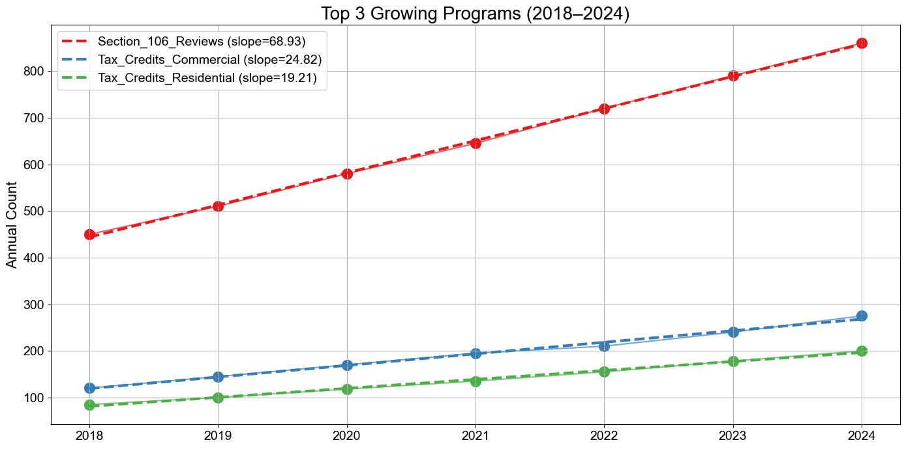

# Helper Functions

> **Portfolio note:** This is a sanitized version of an internal work repository, shared for portfolio purposes. Database server names, instance names, and other infrastructure identifiers have been replaced with placeholders (e.g., `YOUR_SERVER\YOUR_INSTANCE`). The code will not connect to a live database as-is — replace the placeholders in `database/database_connections.py` with valid SQL Server endpoints to use it.

A Python utility library for various processes at a state historic preservation office. The package can connect to a Microsoft SQL Server database (CRIS/CRISGIS) and also provides tools for data cleaning, DataFrame comparison, audit pipeline orchestration, and publication-quality reporting charts. This is meant to be a reusable package that can be used across various data projects and reduce the need to copy the same scripts and created functions from one project to another. This was implemented after doing that multiple times. 

---

## Documentation

**Full docs site:** https://travis-magaluk.github.io/Helper_Functions/

Quick links:

- [Getting Started](https://travis-magaluk.github.io/Helper_Functions/getting-started/)
- [Audit Pipeline](https://travis-magaluk.github.io/Helper_Functions/audit/)
- [Database Connections](https://travis-magaluk.github.io/Helper_Functions/database/)
- [Data Cleaning](https://travis-magaluk.github.io/Helper_Functions/data_cleaning/)
- [DataFrame Comparison](https://travis-magaluk.github.io/Helper_Functions/dataframe_comparison/)
- [Reporting — Bar Charts](https://travis-magaluk.github.io/Helper_Functions/reporting/bar-charts/)
- [Reporting — Regression & Trends](https://travis-magaluk.github.io/Helper_Functions/reporting/regression-and-trends/)

---

## Package Structure

```
Helper_Functions/
├── audit/                        # Commercial tax credit audit logic
│   ├── commercial_audit.py       # Core helper functions (standardize, compare, find missing)
│   ├── commercial_audit_pipeline.py  # High-level pipeline functions
│   ├── commercial_lists_dicts.py # Column-name mappings and decision normalization constants
│   ├── commercial_sql.py         # SQL query strings used by audit functions
│   └── SQL/                      # Raw .sql files for ad-hoc queries
├── database/
│   └── database_connections.py   # DBConnector (production) and TEST_DBConnector (test)
├── data_cleaning/                # Standalone DataFrame/text cleaning utilities
│   ├── text_clean.py             # Address and text normalization
│   ├── safe_text_clean.py        # NaN-safe text operations
│   ├── date_clean.py             # Date string conversion
│   ├── money_clean.py            # Monetary value cleaning
│   ├── column_splitting.py       # Column decomposition helpers
│   └── text_clean_pipeliness.py  # Composed cleaning pipelines
├── dataframe_comparison/         # Column-level comparison between two DataFrames
│   ├── compare_columns.py        # Core comparison functions and comparison-dict runner
│   ├── difference_reporting.py   # Difference analysis and summary reporting
│   └── legacy_comp_cols.py       # Legacy pipeline (superseded; kept for reference)
├── reporting/                    # Chart and reporting helpers
│   ├── graph_creation_2.py       # Bar chart creation with full styling control
│   ├── regression_analysis.py    # Scatter/regression plots and trend analysis
│   └── general_reporting.py      # NaN count summaries
└── saved_lists_dicts/
    └── pivot_dict.py             # Pivot table configuration reference mostly depreciated. 
```

---

## Setup

### Requirements

- Python 3.10+
- Microsoft SQL Server access via Windows Trusted Connection (domain-joined machine) (permissions needed through ITS as well)
- Dependencies: `pandas`, `numpy`, `matplotlib`, `statsmodels`, `sqlalchemy`, `pyodbc`

### Python Path

The package uses absolute imports with the `Helper_Functions.` prefix. Add the parent directory of this folder to your Python path:

```python
import sys
sys.path.append(r"C:\path\to\parent_of_Helper_Functions")
```

Or configure your Jupyter kernel / IDE to include that directory in `sys.path`.

---

## Quick Start

### Run the full decision audit pipeline

```python
import pandas as pd
import Helper_Functions.audit.commercial_audit_pipeline as cap

# Load the NPS quarterly report (Excel or CSV)
nps_report = pd.read_excel("data/input/2025_Q1_NPS_Report.xlsx")

# Find decisions in the spreadsheet that are missing from CRIS
# Exports results to data/output/2025_Q1/2025_Q1_Missing_Decisions.csv
missing_decisions, missing_nps_numbers = cap.decision_audit_pipeline(
    NPS_quarterly_report=nps_report,
    date_buffer=7,
    year=2025,
    quarter=1,
)

print(missing_decisions.head())
print("Missing NPS numbers:", missing_nps_numbers)
```

### Plot a bar chart

```python
import pandas as pd
import Helper_Functions.reporting.graph_creation_2 as gc

df = pd.DataFrame({
    "Year": [2020, 2021, 2022, 2023],
    "Part 1": [120, 145, 98, 160],
    "Part 2": [95, 110, 80, 130],
})

gc.create_bar_chart_from_df(
    df,
    columns=["Part 1", "Part 2"],
    x="Year",
    title="Tax Credit Applications by Part",
    ylabel="Applications",
    stacked=True,
    annotate_bars=True,
    show_trendlines=True,
)
```


### Trend analysis and regression plot

```python
import Helper_Functions.reporting.regression_analysis as ra

# df has a numeric year index and one program/agency per column
df = pd.DataFrame(
    {
        "Tax_Credits_Commercial": [120, 145, 170, 195, 210, 240, 275],
        "Tax_Credits_Residential": [85, 100, 118, 135, 155, 178, 200],
        "Section_106_Reviews":     [450, 510, 580, 645, 720, 790, 860],
        "NR_Nominations":          [28, 30, 32, 35, 33, 38, 40],
        "Survey_Reports":          [75, 72, 78, 70, 68, 72, 65],
        "Easements":               [22, 20, 18, 19, 15, 14, 12],
    },
    index=[2018, 2019, 2020, 2021, 2022, 2023, 2024],
)
df.index.name = "Year"

stats = ra.plot_top_trends(
    df,
    top_x=3,
    trend="increasing",
    title="Top 3 Growing Programs (2018–2024)",
    y_label="Annual Count",
    connecting_lines=True,
    figsize=(14, 7),
    palette='Set1'
)
```


---

## Module Summaries

### `audit/`

The audit module supports the quarterly NPS decision audit workflow. The typical flow is:

1. **Load** the raw NPS quarterly Excel export.
2. **Standardize** column names and decision values using `commercial_lists_dicts` constants.
3. **Convert** wide Part1/2/3 columns to a tall (database-friendly) format.
4. **Compare** against existing CRIS decisions with a configurable date tolerance.
5. **Export** missing decisions to CSV or Excel.
6. **Clean** missing decisions/NPS numbers are manually entered into CRIS.
7. **Database Health** finds missing financials or other key metrics within CRIS. 

Key functions:

| Function | Module | Purpose |
|---|---|---|
| `decision_audit_pipeline()` | `commercial_audit_pipeline` | End-to-end orchestration (steps 1–5) |
| `database_health_pipeline()` | `commercial_audit_pipeline` | Missing financials/housing, duplicate NPS numbers, non-spatial USNs (ran once missing decisions and NPS numbers are populated) |
| `standardize_nps_quarterly_reports()` | `commercial_audit` | Normalize raw NPS sheet |
| `find_missing_decisions_with_date_buffer()` | `commercial_audit` | Core diff logic |

See the [audit docs](https://travis-magaluk.github.io/Helper_Functions/audit/) for detailed function reference.

### `database/`

Two connectors — use `DBConnector` for production work and `TEST_DBConnector` when validating against the non-production environment. Both use Windows Trusted Connection.

```python
from Helper_Functions.database.database_connections import DBConnector

db = DBConnector()
df = db.fetch_data("SELECT TOP 10 * FROM tblTaxCreditCommercial")
```

See the [database docs](https://travis-magaluk.github.io/Helper_Functions/database/).

### `reporting/`

Publication-quality charts built on Matplotlib. `graph_creation_2.py` exposes a single highly-parameterized function for bar charts; `regression_analysis.py` provides scatter/OLS plots and automated trend ranking. Used to standardize graphs and charts created across reporting projects. 

See the [reporting docs](https://travis-magaluk.github.io/Helper_Functions/reporting/).

### `data_cleaning/`

Standalone, NaN-safe text and data cleaning utilities designed for address normalization, monetary value parsing, and date conversion. Functions are designed to work with `df.apply()`.

See the [data cleaning docs](https://travis-magaluk.github.io/Helper_Functions/data_cleaning/).

### `dataframe_comparison/`

A framework for comparing two DataFrames column-by-column (string or numerical, with configurable tolerance). Includes difference summaries and reduction analysis. Used extensively in Tax Credit Migration project when reconciling four disparate data sets. 

> **Note:** `legacy_comp_cols.py` is an older pipeline kept for reference. Prefer `compare_columns.py` and `difference_reporting.py` for new work.

See the [dataframe comparison docs](https://travis-magaluk.github.io/Helper_Functions/dataframe_comparison/).

---

## Database Connections

| Connector | Server | Use |
|---|---|---|
| `DBConnector` | `YOUR_SERVER\YOUR_INSTANCE` | Production CRIS database |
| `TEST_DBConnector` | `YOUR_TEST_SERVER\YOUR_TEST_INSTANCE` | Test/non-production CRIS database |

Both databases are named `CRIS` and use Windows Trusted Authentication. The machine running the code must be domain-joined with appropriate SQL Server permissions.

---

## Output Conventions

Pipeline functions in `/audit` write to `data/output/{Year}_{Quarter}/` by default. The directory is created automatically if it does not exist.

```
data/output/
└── 2025_Q1/
    ├── 2025_Q1_Missing_Decisions.csv
    ├── 2025_Q1_Missing_Financials_Housing.csv
    ├── 2025_Q1_Duplicate_NPS_Numbers.csv
    └── 2025_Q1_Nonspatial_USN.csv
```

Pass `output_format="excel"` to `database_health_pipeline()` to receive a single `.xlsx` workbook with one sheet per check instead.
