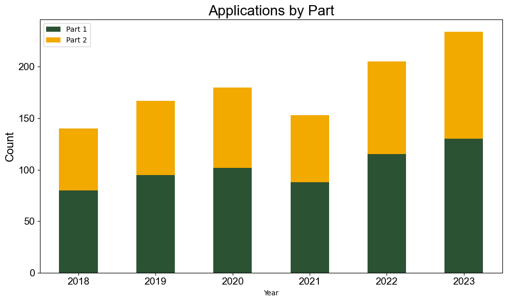
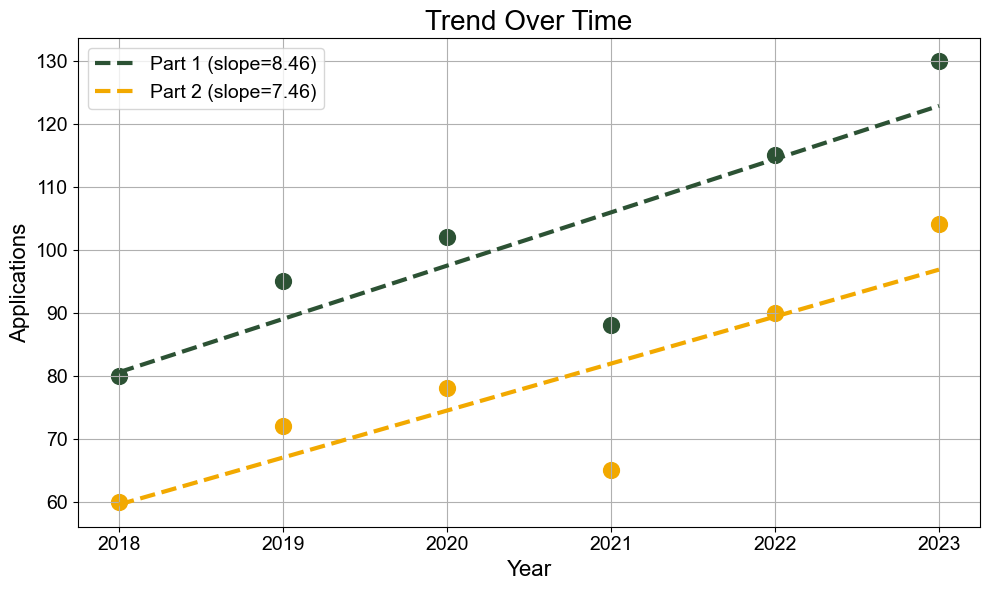

# Reporting

The `reporting/` module provides publication-quality charts and summaries built on Matplotlib.

## Modules

| File | Key Functions |
|---|---|
| `graph_creation_2.py` | `create_bar_chart_from_df()` |
| `regression_analysis.py` | `regression_analysis_2()`, `analyze_trends()`, `plot_top_trends()` |
| `general_reporting.py` | `count_nan_per_column()` |

## Design philosophy

All chart functions accept a large set of optional keyword arguments with defaults alligned with an internal style guide (green/gold color scheme, Arial font, comma-formatted y-axis ticks). You can produce a basic chart with 3–4 arguments and progressively add styling as needed.

## Quick example

```python
import pandas as pd
import Helper_Functions.reporting.graph_creation_2 as gc
import Helper_Functions.reporting.regression_analysis as ra

df = pd.DataFrame({
    "Year": [2018, 2019, 2020, 2021, 2022, 2023],
    "Part 1": [80, 95, 102, 88, 115, 130],
    "Part 2": [60, 72, 78, 65, 90, 104],
})

# Bar chart
gc.create_bar_chart_from_df(
    df, columns=["Part 1", "Part 2"], x="Year",
    title="Applications by Part", ylabel="Count", stacked=True,
)
```




```python
# Regression plot
stats = ra.regression_analysis_2(
    df, x_col="Year", y_cols=["Part 1", "Part 2"],
    title="Trend Over Time", x_label="Year", y_label="Applications",
)
print(stats)
```


## See also

- [Bar Charts](bar-charts.md) — full parameter reference and examples
- [Regression & Trends](regression-and-trends.md) — OLS plots and top-trend ranking
